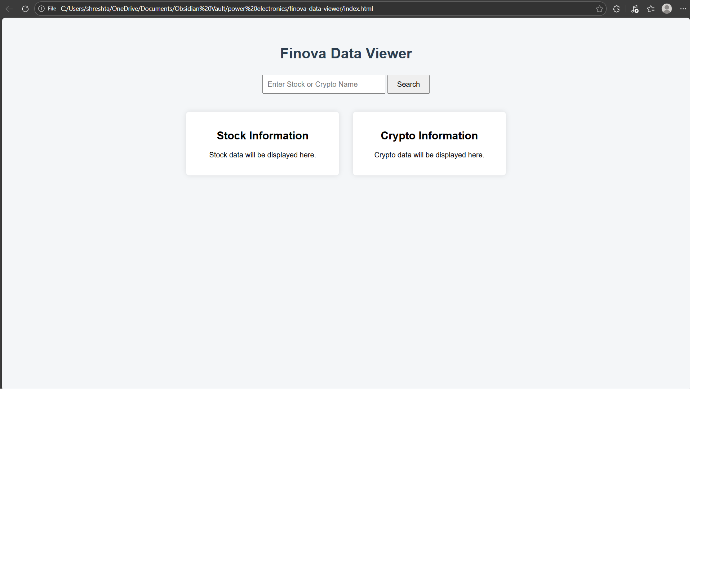
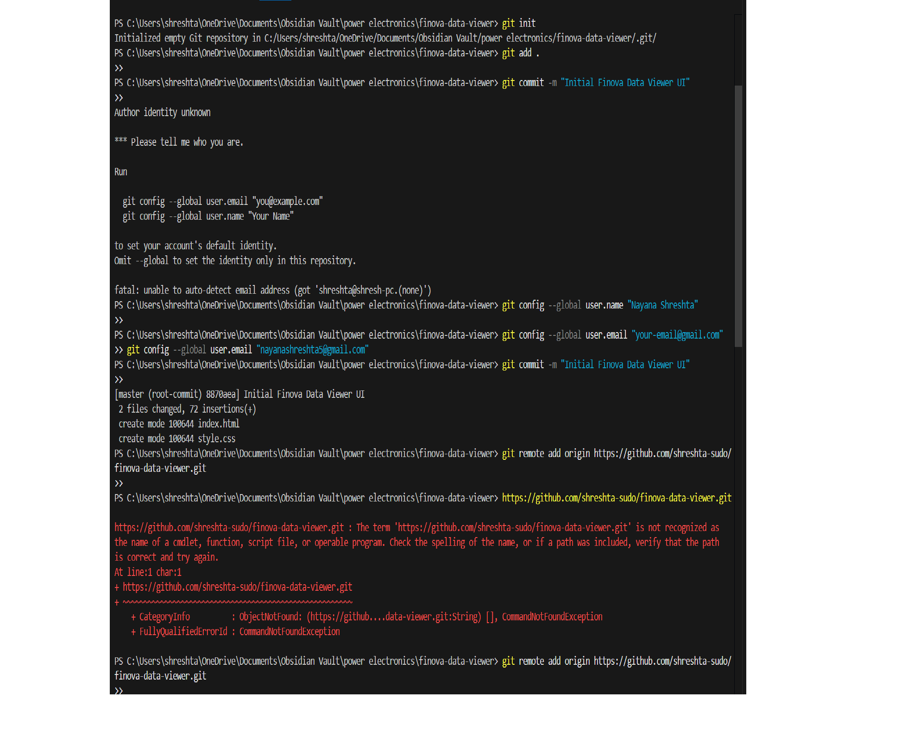
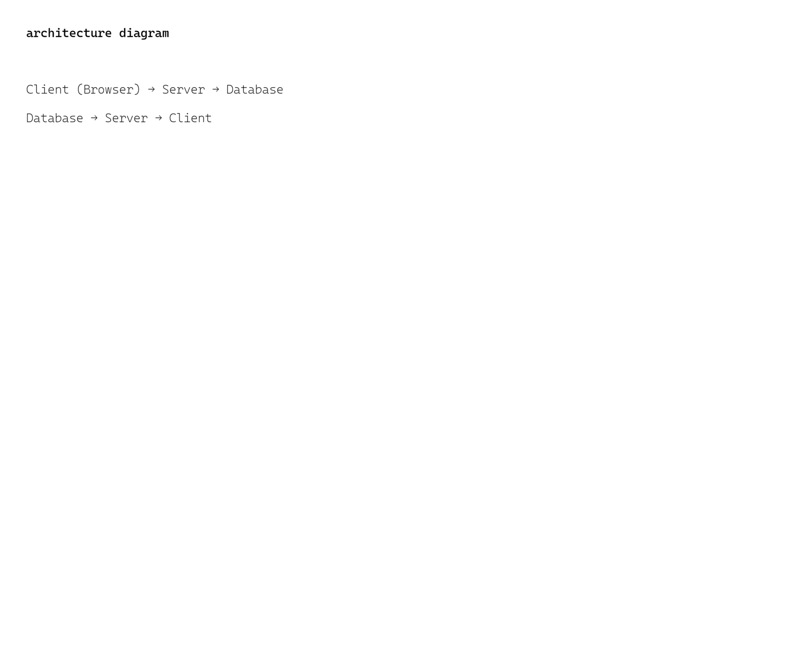

# Fintech-Task 1

## Introduction
This project is a simple user interface for a FinTech Data Viewer called **Finova Data Viewer**

## 1. Client–Server Model

### What is a Client?
A client is the user-facing application that interacts with the user.
In this project, the client is the web browser that displays the Finova Data Viewer UI.

### What is a Server?
A server is a system that processes requests from the client and sends back responses.
In real applications, the server handles logic, APIs, and data processing.

### How Do They Communicate?
The client and server communicate using HTTP requests and responses over the internet.

### What Happens When the User Clicks “Search”?
When the user clicks the “Search” button:
1. The browser sends a request to the server with the entered stock or crypto name.
2. The server processes the request.
3. The server fetches data from a database or external API.
4. The server sends the data back to the client.
5. The browser displays the data on the UI.

## 2. How Full-Stack Applications Work

### Frontend
The frontend is the part of the application the user sees and interacts with.
It is built using HTML and CSS in this project.

### Backend
The backend handles application logic, data processing etc.
It is usually built using programming languages like Python, Java.

### Database
A database stores application data such as stock prices, crypto values, and user information.

### APIs
APIs act as a bridge between the frontend and backend.
They allow the frontend to request and receive data from the backend.

### Interaction Between Layers
1. User interacts with the frontend.
2. Frontend sends a request to the backend through an API.
3. Backend fetches or processes data from the database.
4. Backend sends data back to the frontend.
5. Frontend displays the data to the user.

## 3. Screenshots

### UI Screenshot

### Git Commands Screenshot

### Architecture Diagram

## 4.Conclusion
This task helped in understanding the basics of web development, Git version control,
and how full-stack applications are structured conceptually.

_last updated for Task 1 submission_